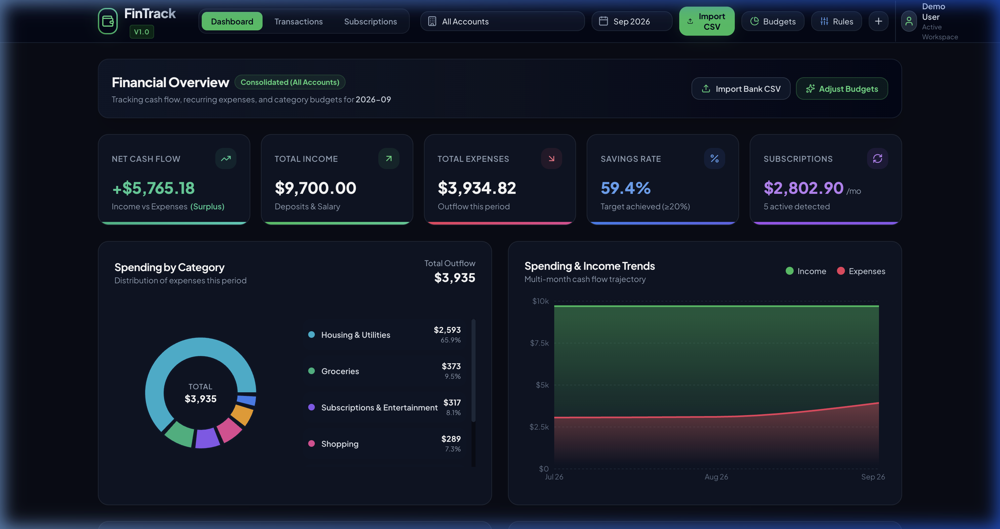

# FinTrack — Intelligent Personal Finance Tracker

FinTrack is an intelligent personal finance tracker designed to tackle the messiness of real-world bank and credit card CSV exports. It features automated format detection, robust normalization (dates, currencies, sign polarity, deduplication), rule-based auto-categorization with user learning, recurring subscription detection, and interactive visual analytics.



---

## 🌟 Key Features

### 1. Robust CSV Parsing & Statement Normalization
- **Bank Format Auto-Detection**:
  - **Chase Bank (US)**: Supports Chase Credit Card (negative purchase amounts, positive payments) and Chase Checking/Savings.
  - **Revolut (EU/UK/Global)**: Handles ISO timestamp formats (`YYYY-MM-DD HH:mm:ss`), EUR/GBP currency amounts, fee columns, and card payments.
  - **Generic Statements**: Auto-detects single `Amount` columns or separate `Debit` and `Credit` columns with high confidence.
  - **Interactive Column Mapper**: Fallback visual column mapper allowing manual assignment of Date, Description, Amount, Debit, Credit, and Type columns.
- **Handling Messy Real-World Data**:
  - **Date Normalization**: Automatically parses `YYYY-MM-DD`, `MM/DD/YYYY` (US), `DD/MM/YYYY` (EU), `DD.MM.YYYY` (German/EU dot delimiter), text months (`15 Jan 2026`), and ISO timestamps.
  - **Amount & Currency Cleaning**: Strips symbols (`$`, `€`, `£`, `₹`), handles European decimal formats (`1.234,56`), parenthesized negatives `(150.00)` $\rightarrow$ `-150.00`, trailing minuses `45.99-`, and `CR` / `DR` suffixes.
  - **Cryptographic Deduplication**: Generates deterministic SHA-256 fingerprints `hash(accountId, date, cleanDescription, amountCents)` to avoid duplicate entries on re-importing overlapping statement files.

### 2. Auto-Categorization & Machine Learning Rules
- **High-Precision Rule Engine**: Automatically matches merchant descriptions against keyword & regex patterns (Groceries, Dining, Transport, Subscriptions, Utilities, Shopping, Income, etc.).
- **User Learning & "Remember Corrections"**: When a user updates a category, FinTrack prompts to save a persistent custom rule that retroactively updates similar transactions and applies to all future CSV imports.
- **Multi-Account Support**: Track statements across checking accounts, credit cards, and multi-currency wallets.

### 3. Analytics, Subscriptions & Budgeting
- **Monthly Net Cash Flow & Savings Rate**: Track Income vs. Expenses, net surplus/deficit, and savings rate percentage.
- **Category Spending Donut Chart**: Interactive Recharts visualization showing proportion and transaction volume per category.
- **Spending Trends Timeline**: Multi-month Area chart illustrating cash flow trajectory over time.
- **Recurring Subscription Detector**: Identifies monthly charges recurring at ~30-day intervals with consistent amounts (Netflix, Spotify, Gym, Utilities) and projects monthly burn and annual renewals.
- **Budget vs. Actual**: Set category spending limits and monitor utilization with green/amber/red status alerts.

---

## 🛠️ Tech Stack

- **Frontend**: React 18, TypeScript, Tailwind CSS, Recharts, Lucide Icons, Vite
- **Backend**: Node.js, Express, TypeScript, PapaParse
- **Database**: SQLite with native `node:sqlite` (zero external C++ compilation dependencies, lightning-fast performance)
- **Authentication**: JWT authentication with bcrypt password hashing + Demo Mode for quick exploration
- **Testing**: Vitest with unit tests for date parsing, currency formatting, debit/credit polarity, and deduplication

---

## 🚀 Getting Started

### Prerequisites
- Node.js v20+ (Node v22+ recommended for native `node:sqlite`)
- npm v10+

### Installation

1. **Clone the repository**:
   ```bash
   git clone https://github.com/your-username/FinTrack.git
   cd FinTrack
   ```

2. **Install dependencies**:
   ```bash
   npm install --prefix server
   npm install --prefix client
   ```

3. **Run in Development Mode**:
   ```bash
   npm run dev
   ```
   - Frontend runs at: `http://localhost:3000`
   - Backend API runs at: `http://localhost:5001`

4. **Run Unit Tests**:
   ```bash
   npm test
   ```
   Runs the Vitest test suite covering:
   - Date parser resolution (US, EU, ISO, text months)
   - Amount and currency polarity normalization
   - Bank preset matching (Chase, Revolut, Generic)
   - SHA-256 deduplication hashing
   - Rule-based categorization and subscription detector

5. **Build for Production**:
   ```bash
   npm run build
   npm start
   ```
   The Express server serves the optimized Vite client production bundle directly from `client/dist`.

---

## 💡 Design Decisions & Architecture

### 1. CSV Parsing Architecture
Naive string splitting (`line.split(',')`) routinely fails on real-world bank exports because descriptions often contain commas (e.g. `"WHOLEFDS SOMA, SAN FRANCISCO, CA"`). FinTrack uses **PapaParse** for:
- Quote-escaped field handling
- Dynamic delimiter detection (`,` vs `;` vs `\t`)
- Streaming support for statements with thousands of rows
- Preamble header stripping: Bank statements often include metadata lines (e.g. `Account: ****1234`) before the table headers; FinTrack detects the real header index automatically.

### 2. Date Ambiguity Handling
Statements from US institutions use `MM/DD/YYYY` while European banks use `DD/MM/YYYY` or `DD.MM.YYYY`.
FinTrack employs a multi-tiered date resolution strategy:
1. First checks for ISO standard format (`YYYY-MM-DD`).
2. Checks numeric values: if the first number $> 12$, it is unambiguously the day (`DD/MM/YYYY`). If the second number $> 12$, it is unambiguously the month (`MM/DD/YYYY`).
3. Dot delimiters (`.`) automatically favor the European format standard.
4. Allows user-selected overrides (`US`, `EU`, `AUTO`) in the CSV Import modal.

### 3. Deduplication Logic
Banks often re-export overlapping date windows. Rather than relying on fragile row numbers or naive description matching, FinTrack computes a normalized transaction fingerprint:
$$\text{hash} = \text{SHA256}(\text{accountId} \parallel \text{normalizedDate} \parallel \text{cleanDescription} \parallel \text{amountCents})$$
This guarantees that re-uploading the same statement will not duplicate transactions, accurately reporting the number of skipped duplicates to the user.

### 4. Categorization Strategy
FinTrack combines a prioritized hierarchy:
1. **User Custom Rules** (Priority 100): User-created exact, contains, or regex rules.
2. **System Default Rules** (Priority 10–50): Curated patterns for groceries, dining, transit, utilities, subscriptions, and payroll.
3. **Interactive Learning**: When a user changes a category in the transactions table, FinTrack prompts to remember the rule. Clicking "Remember Rule & Apply" creates a persistent rule and retroactively normalizes all similar historic transactions.

---

## 🚢 Deployment (Railway / Vercel / Render)

FinTrack is pre-configured for simple single-command deployment:
- **Railway / Render**: Deploy the root directory with `npm run build` and start command `npm start`. Set `PORT=5001`.
- **Database Persistence**: SQLite database file is stored in `server/data/fintrack.db`. In container environments, mount a persistent volume to `/app/server/data`.

---

## 📄 License
MIT License. Built for seamless personal financial tracking.
